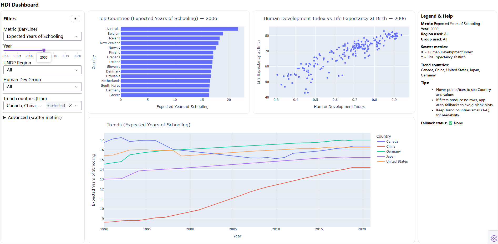

# Dashboard Proposal: Global Human Development Explorer

## 1. Motivation and Purpose

**Our role:** Student data science team acting as a public-interest analytics group  

**Target audience:**  
Policy analysts, researchers, and the general public interested in global development trends.

Human development indicators such as education, health, and income are widely used to evaluate social progress across countries, yet they are often presented in static tables or long reports that are difficult to explore interactively. This limits the ability of non-technical users to compare countries, identify trends over time, and understand relationships between development indicators.

The goal of this project is to build an interactive dashboard that enables users to explore global human development data across countries and years. By providing intuitive visualizations and filters, the dashboard will allow users to compare development outcomes, observe temporal trends, and investigate relationships between key indicators such as education attainment, life expectancy, and the Human Development Index (HDI). This tool aims to support exploratory analysis, public communication, and evidence-based discussion of global inequality and development progress.

---

## 2. Description of the Data

The dashboard will visualize publicly available global human development data derived from United Nations Development Programme (UNDP) sources. The dataset contains country-level indicators measured annually over multiple decades.

Key variables include:

- **Country**: Country or territory name  
- **Year**: Observation year  
- **Human Development Index (HDI)**: Composite index measuring average achievement in health, education, and income  
- **Expected Years of Schooling**: Number of years a child entering school can expect to receive  
- **Life Expectancy at Birth**: Average number of years a newborn is expected to live  
- **UNDP Region**: Geographical grouping defined by UNDP  
- **Human Development Group**: Development classification (e.g., very high, high, medium, low)

The dataset is structured in a tidy (long) format where each row represents a single metric for a given country and year. This structure supports flexible filtering, aggregation, and visualization. Given the limited timeframe of the project, the dashboard will focus on a small set of core indicators rather than attempting to visualize every available variable.

---

## 3. Research Questions and Usage Scenarios

This dashboard is designed to support exploratory questions such as:

- How do countries compare in terms of education, health, and overall human development in a given year?
- How have key development indicators changed over time for selected countries?
- What relationships exist between different development indicators (e.g., HDI and life expectancy)?
- How do development outcomes differ across regions or development groups?

**Usage scenario:**

Alex is a policy analyst working on an international development report. Alex wants to understand how education outcomes relate to overall human development across countries. Upon opening the Global Human Development Explorer, Alex first views a ranked bar chart of countries by expected years of schooling for a selected year. Alex then uses filters to focus on specific regions and selects several countries of interest to examine their trends over time. Finally, Alex explores a scatter plot comparing HDI and life expectancy to identify broader global patterns and potential outliers. These insights help Alex frame comparative narratives and identify areas requiring further investigation.

---

## 4. Description of the App & Sketch

The dashboard interface is organized into three main panels. A collapsible sidebar on the left provides controls for selecting metrics, years, regions, development groups, and countries for trend analysis. The central panel displays multiple coordinated visualizations, including a horizontal bar chart showing top countries for a selected metric, a scatter plot illustrating relationships between two indicators, and a line chart tracking trends over time for selected countries. A contextual legend and help panel on the right summarizes the current selections and provides usage guidance.

The design emphasizes clarity, comparability, and ease of exploration, allowing users to quickly adjust filters and immediately see the impact on all visualizations.

